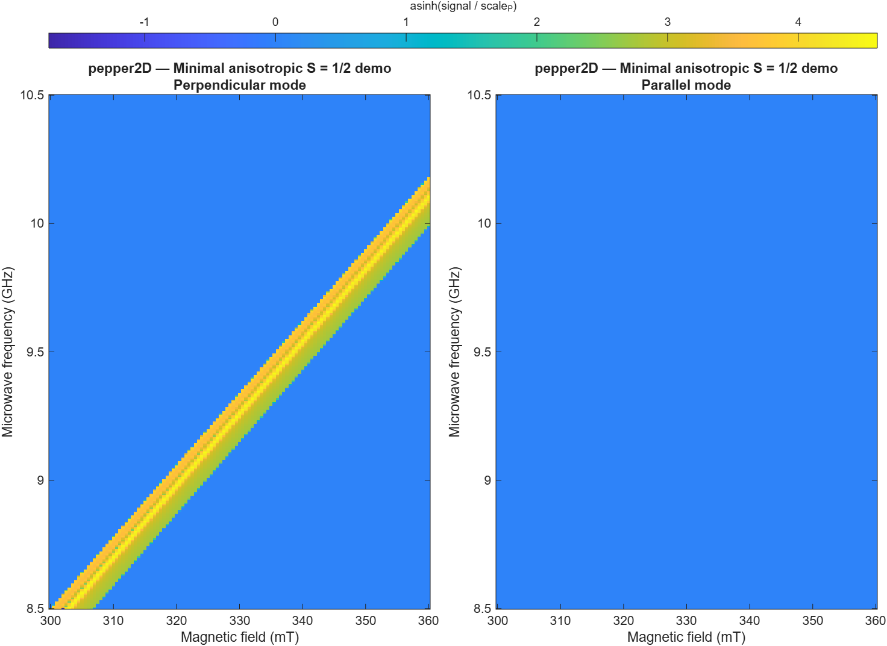

# EasySpin2D
2D map versions (field and frequency) of garlic, pepper, and chili from [EasySpin](https://easyspin.org/).

Instructions:
1. Make sure you have EasySpin installed.
2. Open the folder in Matlab
3. Right-click on Demo.m -> Open as Live Script
4. Run all sections. You should see figures that look like this.

